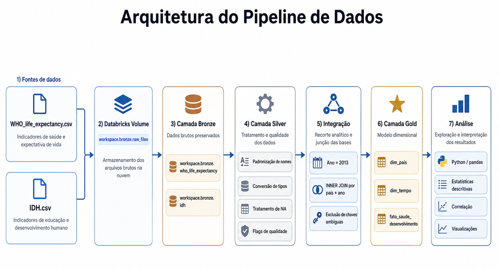
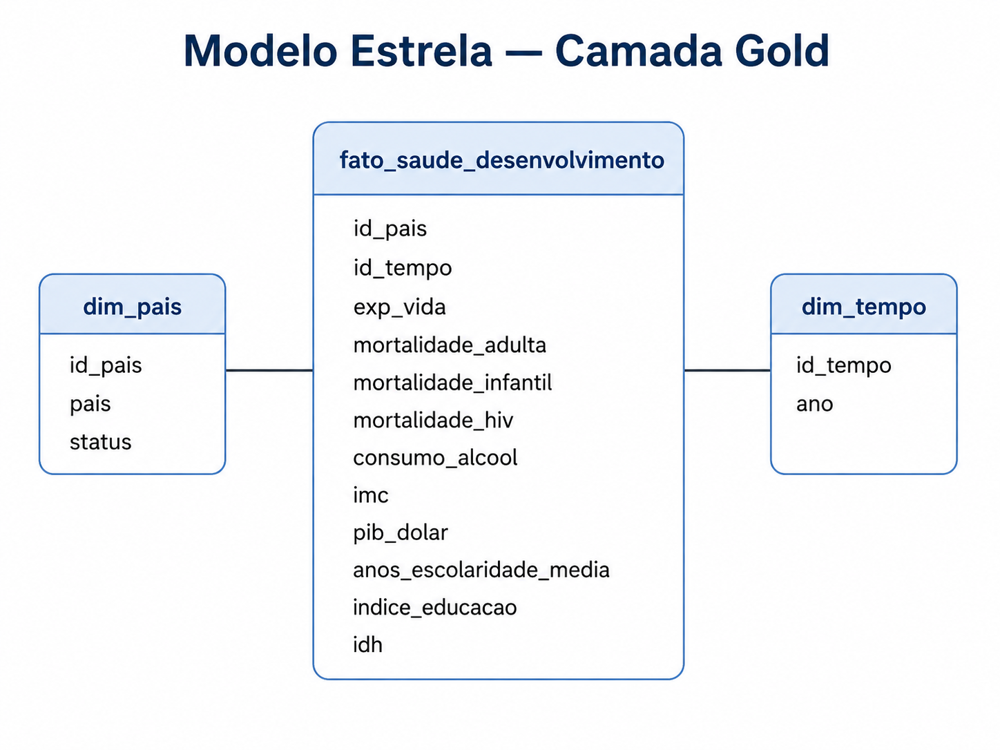

# MVP — Expectativa de Vida e Desenvolvimento Humano no Databricks

## Sobre o projeto

Este projeto foi desenvolvido como MVP da pós-graduação em Ciência de Dados e Analytics e tem como objetivo construir um pipeline de dados em nuvem utilizando a plataforma Databricks.

Foram integradas duas bases públicas contendo indicadores internacionais de saúde, educação e desenvolvimento socioeconômico. O pipeline contempla armazenamento dos arquivos originais, ingestão, avaliação da qualidade, transformação, integração, modelagem dimensional e análise dos dados.

A arquitetura foi organizada segundo o modelo Medallion, utilizando as camadas Bronze, Silver e Gold.

O recorte analítico adotado foi o ano de 2013, escolhido por apresentar elevada cobertura simultânea entre as fontes utilizadas, especialmente para os indicadores de desenvolvimento humano.

---

## Objetivo

Analisar as diferenças na expectativa de vida entre países em 2013 e investigar sua relação com indicadores educacionais, econômicos e de saúde, a partir da construção de um pipeline de dados em nuvem.

### Perguntas do MVP

O projeto busca responder às seguintes perguntas:

1. Como a expectativa de vida estava distribuída entre os países analisados em 2013?
2. Existem diferenças na expectativa de vida entre países classificados na fonte como desenvolvidos e em desenvolvimento?
3. Qual é a relação entre escolaridade e expectativa de vida?
4. Qual é a relação entre PIB per capita e expectativa de vida?
5. Quais indicadores de saúde apresentam maior associação com a expectativa de vida?
6. Como o IDH se relaciona com a expectativa de vida?
7. Quais países apresentaram os maiores e menores valores de expectativa de vida no período analisado?

---

## Fontes dos dados

Foram utilizadas duas bases de dados públicas:

### Expectativa de vida e indicadores de saúde

* Arquivo: `WHO_life_expectancy.csv`
* Conteúdo: expectativa de vida, mortalidade, consumo de álcool, IMC, PIB per capita e outros indicadores de saúde.
* Fonte: KAGGLE — Life Expectancy (WHO)
* URL: https://www.kaggle.com/datasets/kumarajarshi/life-expectancy-who/data
* Licença/condições de uso: Domínio público — CC0 1.0 Universal (CC0: Public Domain)
* Data de acesso: 22/08/2026

### Desenvolvimento humano e educação

* Arquivo: `IDH.csv`
* Conteúdo: anos médios de escolaridade, índice de educação e Índice de Desenvolvimento Humano.
* Fonte: United Nations Development Programme (UNDP) — Human Development Reports
* URL: https://hdr.undp.org/data-center/documentation-and-downloads
* Licença/condições de uso:  Creative Commons Atribuição 3.0 IGO (CC BY 3.0 IGO)
* Data de acesso: 22/08/2026

Os arquivos originais não são disponibilizados neste repositório. As fontes acima permitem obter os dados utilizados para reprodução do projeto.

---

## Tecnologias utilizadas

* Databricks
* Python
* PySpark
* pandas
* NumPy
* Matplotlib
* Delta Lake
* Unity Catalog
* GitHub

---

## Arquitetura do pipeline

Os arquivos originais foram armazenados em um Databricks Volume e posteriormente processados nas camadas Bronze, Silver e Gold.



O fluxo utilizado foi:

**Fontes → Databricks Volume → Bronze → Silver → Integração → Gold → Análise**

### Bronze

Preserva os dados próximos ao formato original das fontes, garantindo rastreabilidade.

### Silver

Responsável pela:

* conversão dos tipos dos atributos;
* transformação de valores `NA` em `NULL`;
* conversão da vírgula decimal;
* padronização dos nomes dos atributos;
* avaliação de duplicidades;
* identificação de valores fora dos domínios esperados;
* criação de indicadores de qualidade.

### Gold

Contém o conjunto integrado e modelado para consumo analítico.

O recorte para 2013 é aplicado nesta etapa, após o tratamento dos dados na Silver.

---

## Qualidade dos dados

A análise de qualidade contemplou principalmente:

* completude dos atributos;
* unicidade da chave composta `país + ano`;
* consistência dos domínios categóricos;
* adequação dos tipos dos dados;
* presença de valores potencialmente inválidos.

Foram identificadas diferenças relevantes de completude entre os atributos e chaves país-ano duplicadas na base de desenvolvimento humano.

Os registros originais permaneceram preservados na Bronze. Na Silver, problemas relevantes foram identificados por meio de flags de qualidade antes da integração.

---

## Integração dos dados

As duas fontes foram conciliadas utilizando a chave composta:

```text
pais + ano
```

Foi utilizado `INNER JOIN`, mantendo apenas registros com correspondência entre as duas fontes.

Antes da integração foram removidas chaves consideradas ambíguas devido à presença de registros duplicados conflitantes.

Após a integração, foi verificada novamente a unicidade da chave país-ano para evitar multiplicação indevida de registros.

A base analítica final de 2013 contém aproximadamente 180 países.

---

## Modelagem dimensional

A camada Gold foi estruturada em um **esquema estrela**.



O modelo contém:

### `dim_pais`

* `id_pais`
* `pais`
* `status`

### `dim_tempo`

* `id_tempo`
* `ano`

### `fato_saude_desenvolvimento`

Contém os principais indicadores quantitativos utilizados nas análises:

* expectativa de vida;
* mortalidade adulta;
* mortalidade infantil;
* mortalidade relacionada ao HIV;
* consumo de álcool;
* IMC;
* PIB per capita;
* anos médios de escolaridade;
* índice de educação;
* IDH.

O catálogo detalhado dos atributos está disponível em:

**[Consultar Catálogo de Dados](docs/catalogo_dados.md)**

---

## Principais resultados

Em 2013, a expectativa de vida apresentou média aproximada de 71,5 anos, com valores variando entre 49,9 e 87 anos nos países com informação disponível.

Entre os indicadores analisados, destacaram-se as seguintes correlações com a expectativa de vida:

| Indicador                      | Correlação |
| ------------------------------ | ---------: |
| IDH                            |      0,893 |
| Índice de educação             |      0,818 |
| Anos médios de escolaridade    |      0,803 |
| Mortalidade adulta             |     -0,717 |
| Mortalidade relacionada ao HIV |     -0,643 |
| Log do PIB per capita          |      0,593 |
| IMC                            |      0,494 |
| Consumo de álcool              |      0,483 |
| Mortalidade infantil           |     -0,231 |

Os indicadores educacionais apresentaram algumas das associações positivas mais fortes com a expectativa de vida. Mortalidade adulta e mortalidade relacionada ao HIV apresentaram associações negativas relevantes.

A correlação entre IDH e expectativa de vida foi interpretada de forma complementar, uma vez que a longevidade constitui uma das dimensões utilizadas na própria construção do IDH.

As correlações representam associações entre os indicadores e não permitem estabelecer relações de causalidade.

---

## Conclusão

Os resultados evidenciaram importantes diferenças na expectativa de vida entre os países analisados em 2013.

Os indicadores de educação apresentaram forte associação positiva com a longevidade, enquanto o PIB per capita também apresentou associação positiva, porém de menor intensidade. Entre os indicadores de saúde, mortalidade adulta e mortalidade relacionada ao HIV apresentaram as associações negativas mais relevantes.

O MVP demonstrou a possibilidade de integrar dados provenientes de diferentes fontes e transformá-los em um modelo analítico estruturado por meio de um pipeline de dados em nuvem.

---

## Limitações

O projeto utiliza um recorte transversal referente ao ano de 2013. Dessa forma, é possível avaliar associações entre os indicadores, mas não analisar sua evolução temporal ou estabelecer relações causais.

Também foram observados dados ausentes em alguns atributos e problemas de unicidade na base de desenvolvimento humano, tratados durante a construção do pipeline.

As análises também dependem das definições, classificações e métodos de coleta utilizados pelas fontes originais.

---

## Autoavaliação

Os principais objetivos definidos para o MVP foram atingidos.

Foi possível construir um pipeline completo no Databricks, abrangendo armazenamento em nuvem, ingestão, camadas Bronze, Silver e Gold, avaliação da qualidade, integração de fontes, modelagem dimensional e análise dos dados.

Entre as principais dificuldades encontradas estiveram a transformação de atributos numéricos originalmente armazenados como texto, o tratamento de valores ausentes, a identificação de duplicidades e a conciliação entre bases provenientes de fontes diferentes.

Como trabalhos futuros, o projeto pode ser ampliado para outros anos, permitindo análises temporais, além da incorporação de novas fontes de dados e métodos estatísticos mais avançados.

---

## Estrutura do repositório

```text
mvp-expectativa-vida-databricks/
│
├── README.md
│
├── 00_configuracao_mvp.ipynb
├── 01_ingestao_bronze.ipynb
├── 02_qualidade_e_silver.ipynb
├── 03_integracao_e_gold.ipynb
├── 04_analise_e_conclusoes.ipynb
│
├── MVP_Expectativa_Vida_Databricks.pdf
│
└── docs/
    ├── catalogo_dados.md
    ├── arquitetura_pipeline.png
    └── modelo_estrela.png
```

---

## Organização dos notebooks

| Notebook                        | Conteúdo                                      |
| ------------------------------- | --------------------------------------------- |
| `00_configuracao_mvp.ipynb`     | Configuração do ambiente, schemas e Volume    |
| `01_ingestao_bronze.ipynb`      | Ingestão dos arquivos e criação da Bronze     |
| `02_qualidade_e_silver.ipynb`   | Qualidade, padronização e criação da Silver   |
| `03_integracao_e_gold.ipynb`    | Recorte de 2013, integração e modelo estrela  |
| `04_analise_e_conclusoes.ipynb` | Análise exploratória, resultados e conclusões |

---

## Como reproduzir o projeto

1. Obter as duas bases a partir dos links informados na seção **Fontes dos dados**.
2. Criar um ambiente Databricks com acesso ao Unity Catalog.
3. Executar os notebooks na seguinte ordem:

```text
00_configuracao_mvp
        ↓
01_ingestao_bronze
        ↓
02_qualidade_e_silver
        ↓
03_integracao_e_gold
        ↓
04_analise_e_conclusoes
```

4. Fazer o upload dos arquivos `WHO_life_expectancy.csv` e `IDH.csv` para o Volume criado no notebook `00`.
5. Executar as demais etapas sequencialmente.

---

## Autor

Projeto desenvolvido como MVP da Pós-Graduação em Ciência de Dados e Analytics na PUC-Rio.
